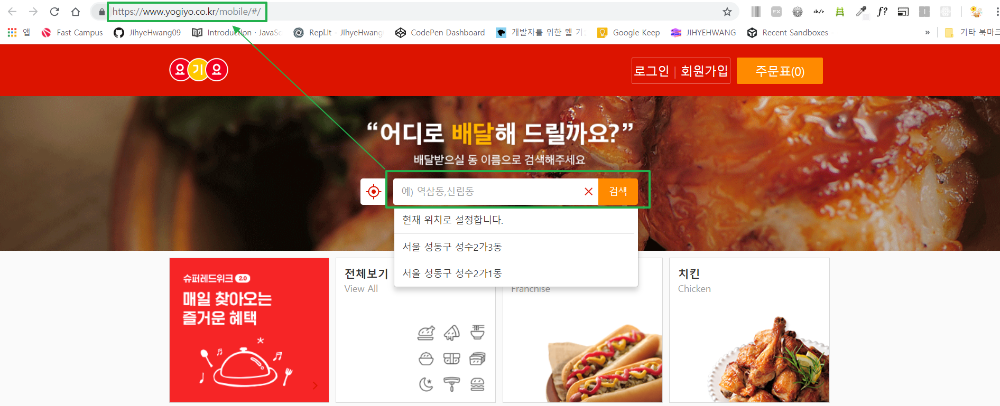
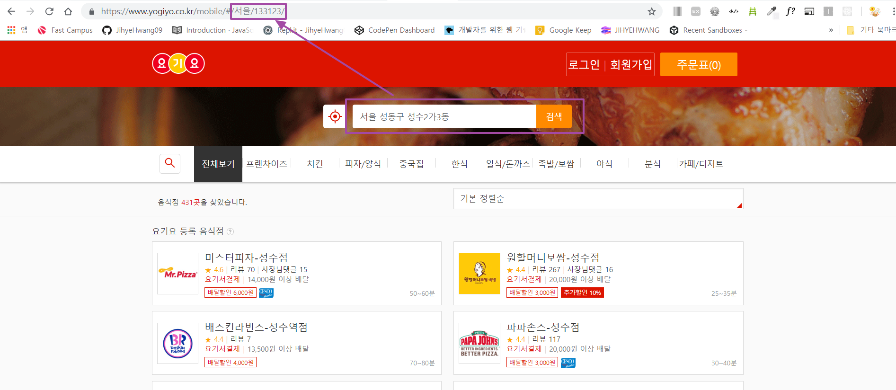
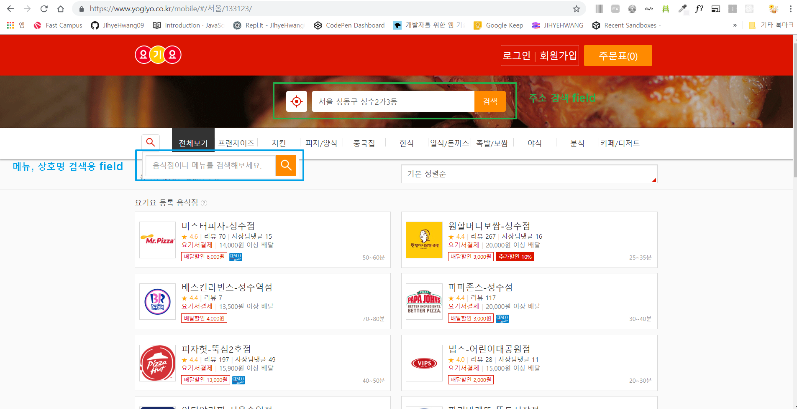

- 주소를 입력하면, 주소표시줄의 주소가 바뀜(ex) '성수3가 3동'검색시 -> url에 '서울/133123/'가 붙음)
- 요기요는 주소 체계가 우편번호인데, 프로젝트로 구현할 때는 우편번호로 하지 말 것
- 대처 방안
    - 해당 동의 이름을 영어 문자열로 하는 주소를 붙일 것
        - ex1) 사당동: `/sadang`
        - ex2) 신사동: `/sinsa`
    - 이런 식으로 슬러그를 만들어서 `주소 표시줄`에 `/sinsa`입력되면 -> `신사동`의 `음식점 목록`을 보여주도록 만들기


---



- `주소 검색용 field`, `메뉴, 상호명 검색용 field`가 따로 있음
- 각각의 presentational 컴포넌트, container 만들기
```
ex)
주소 검색용:  presentational 컴포넌트, container
메뉴, 상호명 검색용:  presentational 컴포넌트, container 
```
- 요기요는 메뉴, 상호명으로 검색했을 때 주소표시줄의 주소에 변화가 x

---
정렬
- 정렬 컨테이너 하나를 만들고, 지금 선택한 정렬 기준이 무엇인지를 저장
- -> 서버로부터 정렬 기준에 해당하는 데이터 가져와서 화면에 그리기

---